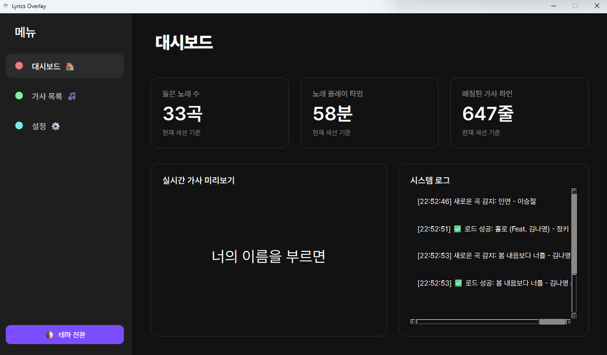
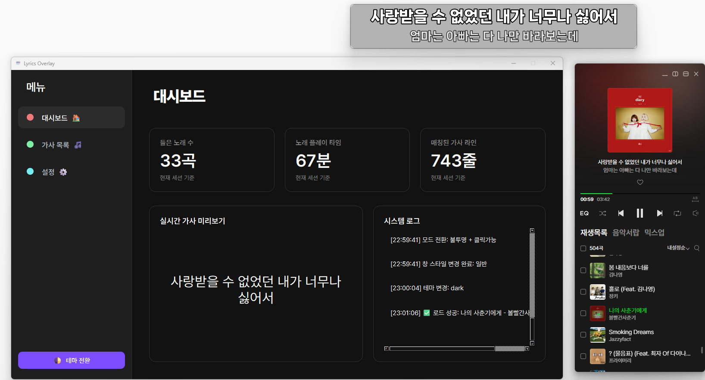
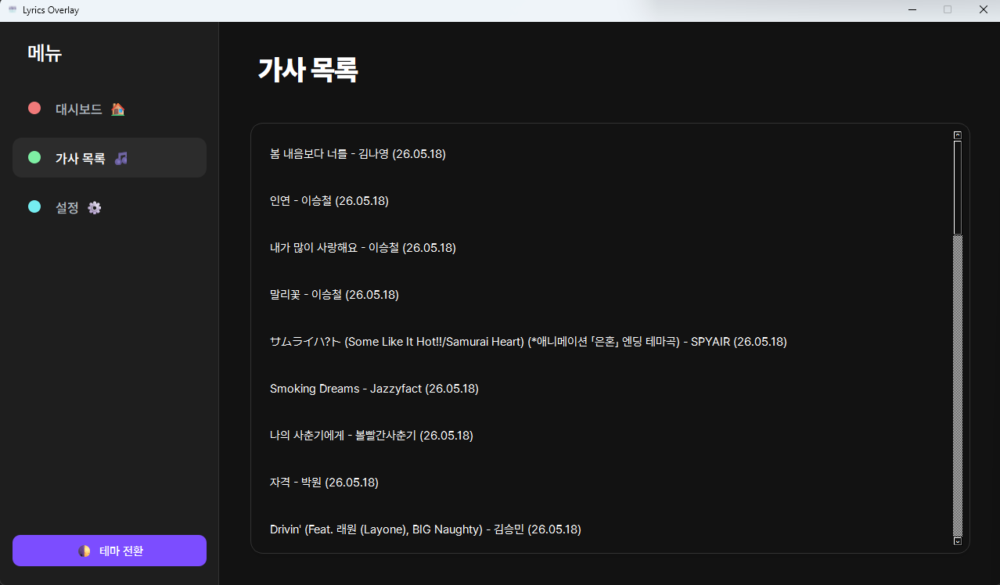
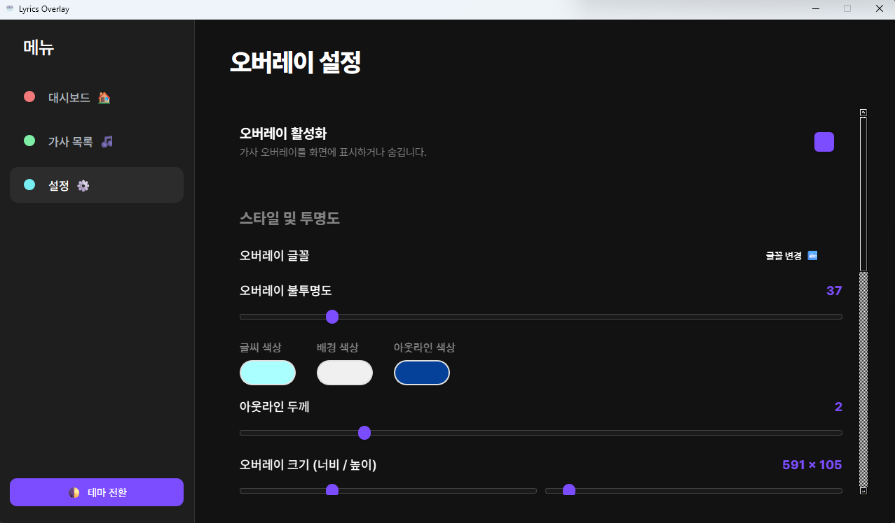

# 🎵 LyricsOverlay

**LyricsOverlay**는 실행 중인 음악의 가사를 실시간으로 인식하여 화면에 스타일리시하게 표시해주는 가사 오버레이 도구입니다. 윈도우 기본 OCR 엔진을 사용하여 정확한 텍스트 인식을 지원하며, 다양한 사용자 설정 기능을 제공합니다.

---

## ✨ 주요 기능

- **실시간 가사 인식 (OCR)**: 윈도우 기본 OCR을 활용하여 멜론, 유튜브 뮤직 등 다양한 플레이어의 가사 영역을 실시간으로 추적합니다.
- **자동 가사 매칭**: 인식된 텍스트와 웹에서 검색된 가사를 비교하여 현재 재생 중인 정확한 구절을 찾아냅니다.
- **커스텀 오버레이**: 투명도, 폰트, 크기, 색상 등 사용자 취향에 맞춘 가사 표시 설정을 지원합니다.
- **간편한 영역 설정**: 마우스 드래그를 통해 가사를 추출할 영역(ROI)을 손쉽게 지정할 수 있습니다.
- **다크 모드 지원**: 현대적인 UI 디자인과 다크 모드를 지원하여 가시성을 높였습니다.

---

## 📸 스크린샷

| 메인 대시보드 | 전체 이미지 |
| :---: | :---: |
|  |  |

| 감상 기록 | 설정 페이지 |
| :---: | :---: |
|  |  |

---

## 🛠️ 설치 방법

프로그램 실행을 위해 Python 3.10 버전이 권장됩니다. 아래 명령어를 통해 필요한 라이브러리를 설치하세요.

```bash
# 저장소 클론 (또는 다운로드)
git clone https://github.com/your-repo/LyricsOverlay.git
cd LyricsOverlay

# 필수 라이브러리 설치
pip install -r requirements.txt
```

---

## 🚀 사용 방법

1. **프로그램 실행**:
   ```bash
   python lyrics_main.py
   ```
2. **음악 스트리밍 앱 실행 (Melon)**:
   -  음악 플레이어를 통해 노래를 재생합니다.

3. **가사 검색 및 시작**:
   - 프로그램이 가사 영역을 인식하면 자동으로 가사를 검색하고 오버레이를 띄웁니다.
   - 오버레이 위치는 자유롭게 이동 가능하며, 설정 메뉴에서 스타일을 변경할 수 있습니다.

---

## 📂 파일 구성

- `lyrics_main.py`: 프로그램의 진입점 및 메인 로직 컨트롤러
- `lyrics_overlay.py`: 가사를 표시하는 투명 오버레이 UI
- `lyrics_searcher.py`: 외부 엔진을 통한 가사 검색 모듈
- `lyrics_matcher.py`: OCR 텍스트와 가사 데이터 정밀 매칭
- `gui/`: 메인 윈도우 및 영역 선택기 등 GUI 구성 요소
- `asset/`: 아이콘, 폰트 및 스크린샷 이미지 리소스
- `🛠️ 도구/`: 유틸리티 스크립트 모음

---

## 📝 라이선스

이 프로젝트는 개인 학습 및 비상업적 용도로 제작되었습니다.
